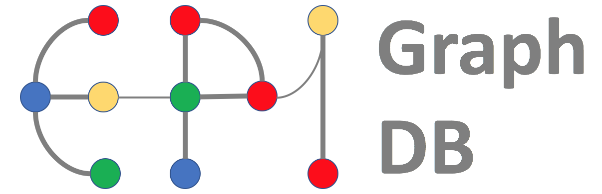

# EpiGraphDB R package `epigraphdb`

<a href="http://epigraphdb.org"></a> <span class="pull-right"> <a href="http://www.bris.ac.uk"></a> <a href="http://www.bris.ac.uk/ieu"></a> </span>

<!-- badges: start -->
[](https://cran.r-project.org/package=epigraphdb)
<!-- badges: end -->

[EpiGraphDB](http://epigraphdb.org) is an analytical platform and database to support data mining in epidemiology. The platform incorporates a graph of causal estimates generated by systematically applying Mendelian randomization to a wide array of phenotypes, and augments this with a wealth of additional data from other bioinformatic sources.
EpiGraphDB aims to support appropriate application and interpretation of causal inference in systematic automated analyses of many phenotypes.

[`epigraphdb`](https://github.com/MRCIEU/epigraphdb-r) is an R package to provide ease of access to EpiGraphDB services.

## Installation

[`devtools`](http://devtools.r-lib.org/)
is required to install from github:

```r
# install.packages("devtools")
devtools::install_github("MRCIEU/epigraphdb-r")
```

**NOTE**: while the package repository is "epigraphdb-r",
the R package name is "epigraphdb".


## Using `epigraphdb`

```r
library("epigraphdb")
#>   EpiGraphDB v0.2
#>
#>   Web API: http://api.epigraphdb.org
#>
#>   To turn off this message, use
#>   suppressPackageStartupMessages({library("epigraphdb")})
mr(outcome = "Body mass index")
#> # A tibble: 370 x 12
#>    exposure_id exposure_name outcome_id outcome_name estimate      se
#>    <chr>       <chr>         <chr>      <chr>           <dbl>   <dbl>
#>  1 627         Epiandroster… 785        Body mass i…   0.0950 2.28e-3
#>  2 541         X-11787       835        Body mass i…  -0.0578 1.77e-4
#>  3 971         Ulcerative c… 835        Body mass i…  -0.0111 1.76e-4
#>  4 60          Waist circum… 835        Body mass i…   0.861  2.07e-2
#>  5 UKB-a:426   Eye problems… 94         Body mass i…  -1.12   1.90e-2
#>  6 UKB-a:373   Ever depress… 95         Body mass i…  -0.616  4.80e-4
#>  7 29          Birth length  95         Body mass i…  -0.141  5.67e-4
#>  8 350         Laurate (12:… 974        Body mass i…   0.418  7.10e-3
#>  9 UKB-a:124   Treatment/me… 974        Body mass i…  -5.14   1.08e-1
#> 10 95          Body mass in… 974        Body mass i…   0.981  2.79e-2
#> # … with 360 more rows, and 6 more variables: p <dbl>, ci_upp <dbl>,
#> #   ci_low <dbl>, selection <chr>, method <chr>, moescore <dbl>)
```

## Other resources

| link                                     | screenshot                                            |
|------------------------------------------|-------------------------------------------------------|
| [API](http://api.epigraphdb.org)         |   |
| [web application](http://epigraphdb.org) |  |

## Citation

If Using EpiGraphDB or the `epigraphdb` R package:

[Elsworth B, Liu Y, Haberland V, Erola P, Lyon M, Zheng J, Gaunt TR. EpiGraphDB. http://epigraphdb.org](http://epigraphdb.org)
