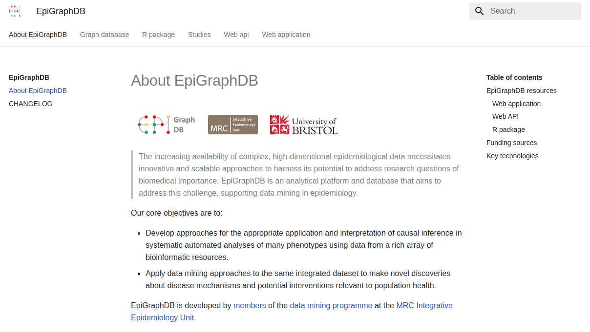
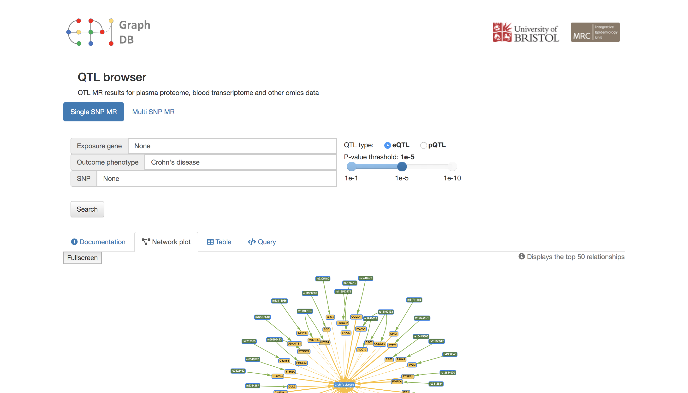
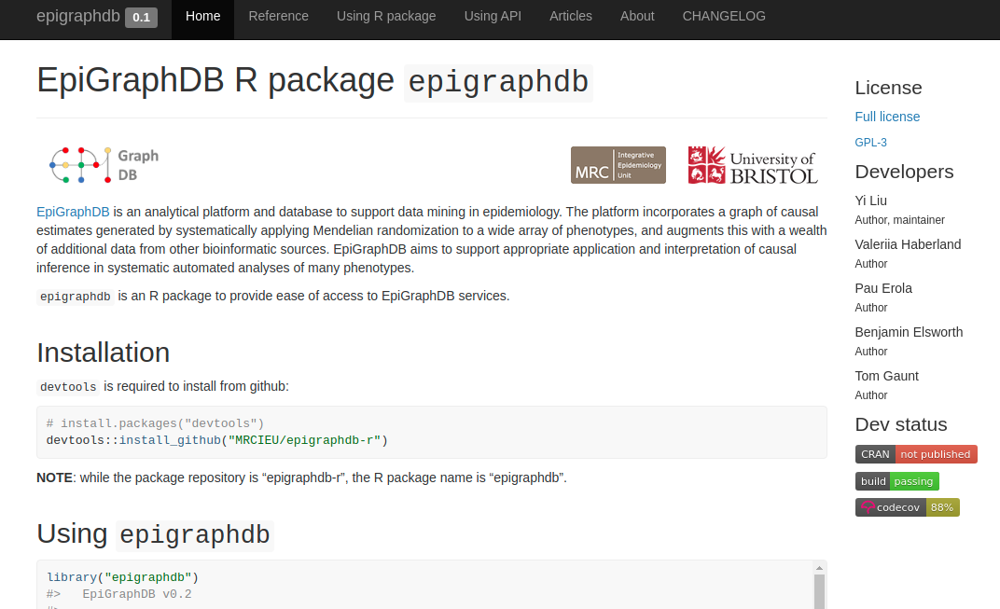

```{r, include = FALSE}
knitr::opts_chunk$set(
  collapse = TRUE,
  comment = "#>"
)
```

[EpiGraphDB](https://epigraphdb.org) is an analytical platform and database to support data mining in epidemiology. The platform incorporates a graph of causal estimates generated by systematically applying Mendelian randomization to a wide array of phenotypes, and augments this with a wealth of additional data from other bioinformatic sources.
EpiGraphDB aims to support appropriate application and interpretation of causal inference in systematic automated analyses of many phenotypes.

[`epigraphdb`](https://github.com/MRCIEU/epigraphdb-r) is an R package to provide ease of access to EpiGraphDB services.

## EpiGraphDB resources

| link                                                | screenshot                                  |
|-----------------------------------------------------|---------------------------------------------|
| [docs](https://docs.epigraphdb.org)                  |         |
| [API](https://api.epigraphdb.org)                    |   |
| [web application](https://epigraphdb.org)            |  |
| [r package](https://github.com/MRCIEU/epigraphdb-r) |    |
